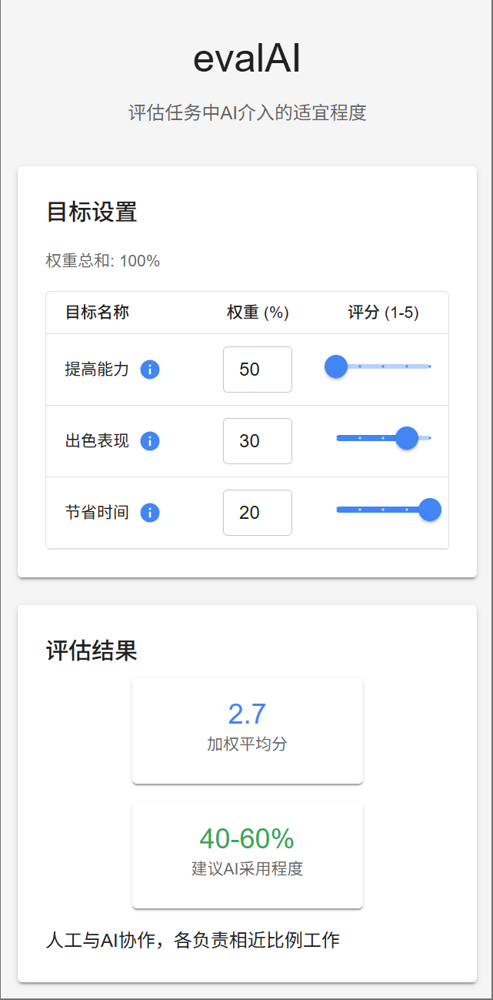
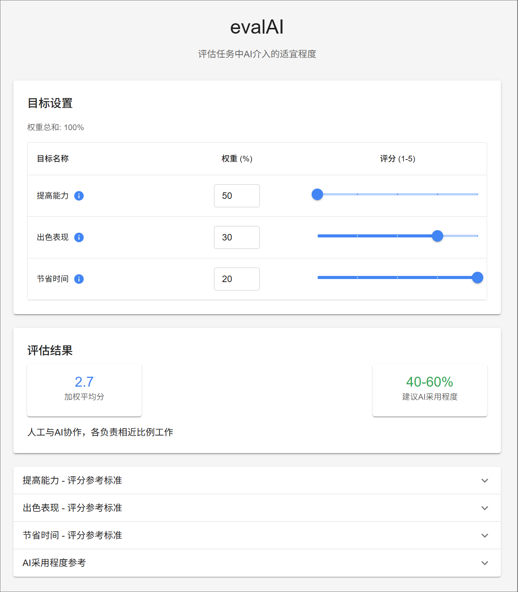

# evalAI

[](https://opensource.org/licenses/MIT)
[](https://reactjs.org/)
[](https://mui.com/)

[English](#english) | [中文](#chinese)

<a id="chinese"></a>
## 中文

这是一个用于评估任务中AI介入适宜程度的Web应用。用户可以为三个固定目标（提高能力、出色表现、节省时间）分配权重和评分，系统会计算加权平均分并给出AI采用程度建议。

### 📋 功能特点

- 包含三个固定评估目标：提高能力、出色表现、节省时间
- 每个目标有专门的评分参考标准和信息提示
- 权重总和自动验证（确保为100%）
- 基于1-5分评分体系
- 自动计算加权平均分
- 根据最终得分提供AI采用程度建议
- 响应式设计，完全适配移动端和PC端
- 使用Google风格的配色方案

### 🖼️ 效果预览




### 🚀 开发技术

- React
- TypeScript
- Material UI (MUI)

### ⚙️ 安装和运行

1. 克隆仓库:

```bash
git clone https://github.com/raphaelxiao/evalAI.git
cd evalAI
```

2. 安装依赖:

```bash
npm install
```

3. 启动开发服务器:

```bash
npm start
```

4. 构建生产版本:

```bash
npm run build
```

### 📝 使用说明

1. 权重设置：为三个目标（提高能力、出色表现、节省时间）分配权重，总和应为100%。
2. 评分：根据参考标准为每个目标打分（1-5分）。
3. 查看结果：系统会自动计算加权平均分，并给出AI采用程度建议。
4. 了解更多：点击目标旁边的信息图标可查看提示信息。
5. 参考标准：展开底部的折叠面板可查看每个目标的详细评分参考标准。

### 📊 评分标准说明

#### 提高能力评分标准
- 1分：这项任务非常有助于提升我的能力和技能
- 2分：这项任务有助于提升我的能力和技能
- 3分：这项任务在能力提升方面影响一般
- 4分：这项任务对能力提升帮助较小
- 5分：这项任务对能力提升几乎没有帮助

#### 出色表现评分标准
- 1分：这项任务不需要特别出色的表现
- 2分：这项任务表现一般即可
- 3分：这项任务需要较好的表现
- 4分：这项任务需要出色的表现
- 5分：这项任务需要极其出色的表现

#### 节省时间评分标准
- 1分：这项任务时间充裕，不需要节省时间
- 2分：这项任务有足够时间完成
- 3分：这项任务时间有限，需要一定效率
- 4分：这项任务时间紧张，需要高效完成
- 5分：这项任务时间非常紧迫，必须最大程度节省时间

### 🔢 AI采用程度参考

- 1.0-1.8分：0-20% - 主要依靠人工，AI辅助少量工作
- 1.8-2.6分：20-40% - 人工为主，AI辅助部分工作
- 2.6-3.4分：40-60% - 人工与AI协作，各负责相近比例工作
- 3.4-4.2分：60-80% - AI为主，人工审核与调整
- 4.2-5.0分：80-100% - 主要依靠AI，人工极少干预

### 🤝 贡献

欢迎贡献代码、报告问题或提出改进建议！请随时提交Pull Request或创建Issue。

### 📄 许可证

本项目基于MIT许可证开源 - 查看 [LICENSE](LICENSE) 文件了解详情。

---

<a id="english"></a>
## English

A web application for evaluating the appropriate level of AI involvement in tasks. Users can assign weights and scores to three fixed objectives (Skill Development, Performance Excellence, Time Saving), and the system calculates a weighted average score to recommend an appropriate AI adoption level.

### 📋 Features

- Three fixed assessment objectives: Skill Development, Performance Excellence, Time Saving
- Specialized scoring references and information tooltips for each objective
- Automatic weight validation (ensuring a total of 100%)
- 1-5 scoring system
- Automatic calculation of weighted average score
- AI adoption level recommendations based on the final score
- Responsive design for both mobile and desktop
- Google-style color scheme

### 🖼️ Preview


### 🚀 Technology Stack

- React
- TypeScript
- Material UI (MUI)

### ⚙️ Installation and Running

1. Clone the repository:

```bash
git clone https://github.com/raphaelxiao/evalAI.git
cd evalAI
```

2. Install dependencies:

```bash
npm install
```

3. Start the development server:

```bash
npm start
```

4. Build for production:

```bash
npm run build
```

### 📝 How to Use

1. Weight Setting: Assign weights to the three objectives (Skill Development, Performance Excellence, Time Saving), ensuring the total is 100%.
2. Scoring: Score each objective (1-5) according to the reference standards.
3. View Results: The system automatically calculates the weighted average score and provides an AI adoption level recommendation.
4. Learn More: Click the information icon next to each objective to view helpful tips.
5. Reference Standards: Expand the collapsible panels at the bottom to view detailed scoring standards for each objective.

### 📊 Scoring Reference Standards

#### Skill Development Scoring Standards
- 1 point: This task significantly contributes to improving my skills and abilities
- 2 points: This task helps improve my skills and abilities
- 3 points: This task has a moderate impact on skill improvement
- 4 points: This task has limited benefit for skill improvement
- 5 points: This task offers almost no benefit for skill improvement

#### Performance Excellence Scoring Standards
- 1 point: This task doesn't require exceptional performance
- 2 points: This task requires average performance
- 3 points: This task requires good performance
- 4 points: This task requires excellent performance
- 5 points: This task requires outstanding performance

#### Time Saving Scoring Standards
- 1 point: This task has ample time, no need to save time
- 2 points: This task has sufficient time for completion
- 3 points: This task has limited time, requiring some efficiency
- 4 points: This task has tight timing, requiring high efficiency
- 5 points: This task is extremely time-sensitive, requiring maximum time savings

### 🔢 AI Adoption Level Reference

- 1.0-1.8 points: 0-20% - Primarily manual work with minimal AI assistance
- 1.8-2.6 points: 20-40% - Human-led with AI assistance for certain aspects
- 2.6-3.4 points: 40-60% - Human-AI collaboration with similar responsibility shares
- 3.4-4.2 points: 60-80% - AI-led with human review and adjustments
- 4.2-5.0 points: 80-100% - Primarily AI-driven with minimal human intervention

### 🤝 Contribution

Contributions, issue reports, and improvement suggestions are welcome! Feel free to submit Pull Requests or create Issues.

### 📄 License

This project is open-sourced under the MIT License - see the [LICENSE](LICENSE) file for details.

